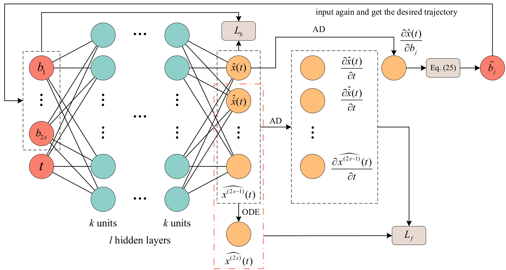
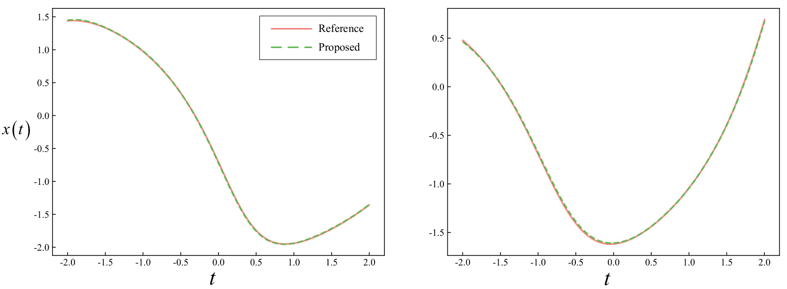
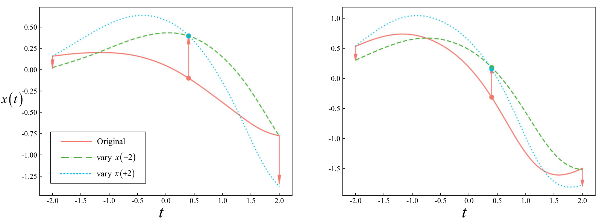
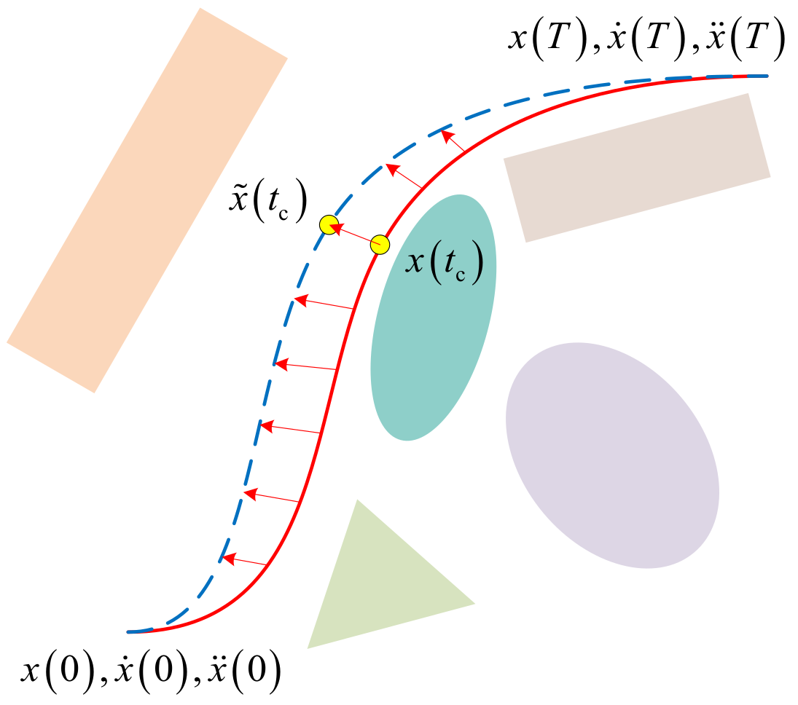

# NNODE
A Data-Free Framework for Solving Ordinary Differential Equations and Refining Trajectories with Neural Networks.

## Introduction
**NNODE** (Neural Network for Ordinary Differential Equations) is a novel data-free learning framework for solving Ordinary Differential Equations (ODEs) and refining trajectories using neural networks.
The framework eliminates the need for ground truth by **embedding differential equations into the loss functions via automatic differentiation**.
By introducing boundary conditions as network inputs, the framework is capable of solving ODEs under **varying boundary conditions** through **one-shot training**.
In addition, it provides a concise and efficient method for trajectory refinement by utilizing the **gradients of outputs with respect to the boundary conditions**.

### Model
<p align="center">

</p>

### Demos
<p align="center">


</p>

### Applications
<p align="center">

</p>

## Dependencies
1. Create a conda environment.
    ```bash
    conda create -n nnode python=3.12
    conda activate nnode
    ```

2. Install dependencies.
    ```bash
    pip install torch
    ```
    **NOTE: install gpu version of [PyTorch](https://pytorch.org/get-started/locally/) if needed.**

    ```bash
    pip install matplotlib scipy loguru tqdm tensorboard tensorboardX
    ```

3. Download the repository.
    ```bash
    git clone git@github.com:ZhanyuGuo/NNODE.git
    ```

## Run
1. Update the options in `src/NNODE/options.py`. 
   
   **NOTE: set `num_workers` to 0 if you are using Windows.**

2. Run the training script.
    ```bash
    source scripts/train.sh
    ```

3. Run the testing script.
    ```bash
    source scripts/test.sh
    ```

4. (optional) Use convert script to convert into scripted model which can be used in libtorch (Pytorch C++ API).
    ```bash
    source scripts/convert.sh
    ```
    More details will be available in the open source repository soon.
